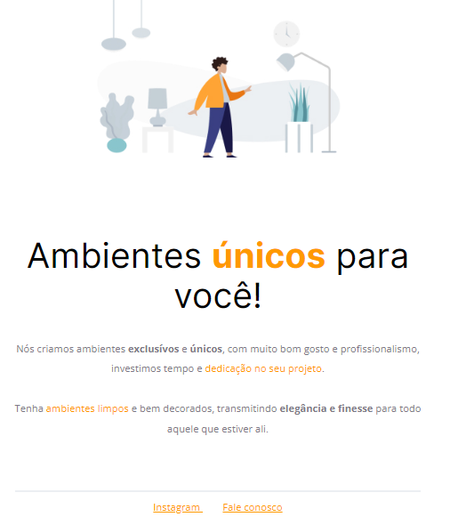

## 💻 Projeto

Desafio do Discover da Rocketseat onde consiste em desenvolver uma página com uma lista de links que pode ser usada em perfis de redes sociais.

## 🚀 Tecnologias

<ul>
  <li>HTML</li>
  <li>CSS</li>
</ul>

## 🔖 Layout do Projeto

O layout pode ser visto através do Figma

[Layout Web](https://www.figma.com/file/hPiboJHJTvPAfbFKI0tWC6/DD-Social-links-Copy?fuid=1044716808414252537)
